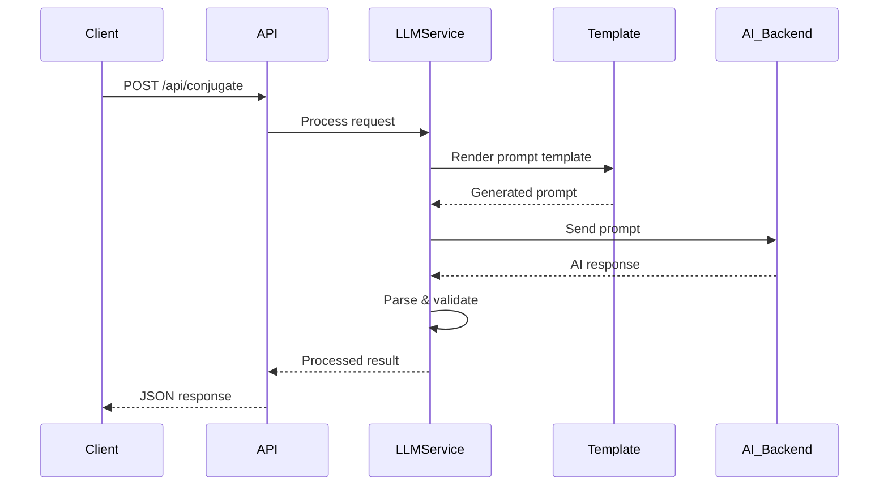

# AI Services API

The AI Services API provides language processing capabilities for Web App CAA, including verb conjugation and sentence correction powered by Large Language Models (LLMs).

## Base URL

```
http://localhost:6542/api
```

## AI Service Overview

Web App CAA integrates with multiple AI backends to provide Italian language processing:

- **Verb Conjugation**: Convert infinitive verbs to appropriate tenses based on sentence context
- **Sentence Correction**: Grammar checking and correction for Italian sentences
- **Template-based Processing**: Uses RAG (Retrieval-Augmented Generation) with curated knowledge

## Supported Backends

| Backend | Description | Use Case |
|---------|-------------|----------|
| **Ollama** | Local LLM inference | Privacy-focused, offline usage |
| **OpenAI** | Cloud-based AI service | High-quality results, requires API key |

## Endpoints

### POST /api/conjugate

Conjugate Italian verbs based on sentence context and target tense.

!!! note "Protected Endpoint"
    Requires valid JWT token in Authorization header.

#### Request

```http
POST /api/conjugate
Authorization: Bearer <jwt-token>
Content-Type: application/json

{
  "sentence": "Io mangiare la pizza",
  "baseForms": ["mangiare"],
  "tense": "presente"
}
```

#### Request Body

| Field | Type | Required | Description |
|-------|------|----------|-------------|
| `sentence` | string | Yes | Sentence containing the verbs to conjugate |
| `baseForms` | array | Yes | List of infinitive verbs to conjugate |
| `tense` | string | Yes | Target tense: `presente`, `passato`, `futuro` |

#### Response

=== "Success (200 OK)"
    ```json
    {
      "mangiare": "mangio"
    }
    ```

=== "Multiple Verbs"
    ```json
    {
      "mangiare": "mangio",
      "bere": "bevo",
      "dormire": "dormo"
    }
    ```

=== "Error (500 Internal Server Error)"
    ```json
    {
      "error": "AI service unavailable"
    }
    ```

#### Supported Tenses

| Tense | Description | Example |
|-------|-------------|---------|
| `presente` | Present indicative | io mangio, tu mangi |
| `passato` | Past perfect (passato prossimo) | io ho mangiato, tu hai mangiato |
| `futuro` | Simple future | io mangerò, tu mangerai |

#### Example Usage

```javascript
const conjugateVerbs = async (sentence, verbs, tense) => {
  const response = await fetch('/api/conjugate', {
    method: 'POST',
    headers: {
      'Authorization': `Bearer ${localStorage.getItem('authToken')}`,
      'Content-Type': 'application/json'
    },
    body: JSON.stringify({
      sentence,
      baseForms: verbs,
      tense
    })
  });
  
  const conjugations = await response.json();
  
  if (response.ok) {
    console.log('Conjugations:', conjugations);
    return conjugations;
  } else {
    console.error('Conjugation failed:', conjugations.error);
    throw new Error(conjugations.error);
  }
};

// Usage example
conjugateVerbs("Io mangiare e bere", ["mangiare", "bere"], "presente")
  .then(result => {
    // Result: {"mangiare": "mangio", "bere": "bevo"}
    console.log(result);
  });
```

### POST /api/correct

Correct grammatical errors in Italian sentences.

!!! note "Protected Endpoint"
    Requires valid JWT token in Authorization header.

#### Request

```http
POST /api/correct
Authorization: Bearer <jwt-token>
Content-Type: application/json

{
  "sentence": "Io mangio la pizza buona"
}
```

#### Request Body

| Field | Type | Required | Description |
|-------|------|----------|-------------|
| `sentence` | string | Yes | Italian sentence to correct |

#### Response

=== "Success (200 OK)"
    ```json
    {
      "corrected_sentence": "Io mangio la buona pizza"
    }
    ```

=== "No Changes Needed"
    ```json
    {
      "corrected_sentence": "Io mangio la pizza buona"
    }
    ```

=== "Error (500 Internal Server Error)"
    ```json
    {
      "error": "AI service unavailable"
    }
    ```

#### Example Usage

```javascript
const correctSentence = async (sentence) => {
  const response = await fetch('/api/correct', {
    method: 'POST',
    headers: {
      'Authorization': `Bearer ${localStorage.getItem('authToken')}`,
      'Content-Type': 'application/json'
    },
    body: JSON.stringify({ sentence })
  });
  
  const result = await response.json();
  
  if (response.ok) {
    return result.corrected_sentence;
  } else {
    console.error('Correction failed:', result.error);
    throw new Error(result.error);
  }
};

// Usage example
correctSentence("Io sono andato a casa ieri")
  .then(corrected => {
    console.log('Corrected:', corrected);
  });
```

## AI Processing Flow



## Template System

The AI service uses Go templates with RAG knowledge for consistent, high-quality results.

### Template Structure

#### Present Tense Template (`presente.tmpl`)
```gotmpl
Sei un meticoloso esperto di grammatica italiana. Il tuo compito è coniugare una lista di verbi al Presente Indicativo in base al pronome soggetto trovato nella frase.

**CONOSCENZA DI RIFERIMENTO (RAG):**
{{.RagKnowledge}}

**FRASE:** {{.Sentence}}
**VERBI:** {{.BaseFormsJSON}}

Rispondi SOLO con un oggetto JSON valido che mappa ogni verbo infinito alla sua forma coniugata.
```

#### RAG Knowledge Integration
```json
{
  "presente_indicativo": {
    "general_rules": {
      "are_verbs": {
        "conjugation": "io -o, tu -i, lui/lei -a, noi -iamo, voi -ate, loro -ano"
      }
    },
    "irregular_verbs": {
      "essere": {
        "conjugation": "io sono, tu sei, lui/lei è, noi siamo, voi siete, loro sono"
      }
    }
  }
}
```

## Configuration

### Environment Variables

Configure AI services with these environment variables:

```env
# AI Backend Selection
BACKEND_TYPE=ollama          # or "openai"

# Ollama Configuration
LLM_HOST=http://localhost:11434
LLM_MODEL=llama2

# OpenAI Configuration  
OPENAI_API_KEY=sk-your-api-key
LLM_MODEL=gpt-3.5-turbo
```

### Backend Comparison

| Feature | Ollama | OpenAI |
|---------|--------|--------|
| **Privacy** | Complete local processing | Data sent to OpenAI |
| **Cost** | Free (local compute) | Pay-per-token |
| **Quality** | Good (model dependent) | Excellent |
| **Speed** | Fast (local) | Very fast (API) |
| **Offline** | Yes | No |
| **Setup** | Requires local installation | API key only |

## Error Handling

### Common Error Responses

#### AI Service Unavailable
```json
{
  "error": "AI service unavailable",
  "details": "Could not connect to LLM backend"
}
```

#### Invalid Request
```json
{
  "error": "Invalid request payload",
  "details": "Missing required field: sentence"
}
```

#### Processing Timeout
```json
{
  "error": "Request timeout",
  "details": "AI processing took too long"
}
```

### Error Handling Best Practices

```javascript
const handleAIRequest = async (requestFn) => {
  try {
    return await requestFn();
  } catch (error) {
    if (error.message.includes('unavailable')) {
      // Fallback to basic functionality
      console.warn('AI service unavailable, using fallback');
      return null;
    } else if (error.message.includes('timeout')) {
      // Retry with shorter timeout
      console.log('Retrying request...');
      return await requestFn();
    } else {
      // Show user-friendly error
      throw new Error('Language processing temporarily unavailable');
    }
  }
};
```

## Performance Considerations

### Caching

The service implements several caching strategies:

- **Template Caching**: Compiled templates are cached in memory
- **RAG Knowledge**: Loaded once at startup
- **Response Patterns**: Common conjugations may be cached

### Rate Limiting

Consider implementing rate limiting for AI endpoints:

```javascript
// Example rate limiting
const rateLimits = {
  '/api/conjugate': '10 requests per minute',
  '/api/correct': '5 requests per minute'
};
```

### Optimization Tips

1. **Batch Requests**: Send multiple verbs in one request
2. **Client-side Cache**: Cache common conjugations
3. **Fallback Handling**: Graceful degradation when AI unavailable
4. **Request Debouncing**: Avoid excessive API calls

## Integration Examples

### Complete AI Service Client

```javascript
class AIService {
  constructor() {
    this.baseURL = '/api';
    this.cache = new Map();
  }
  
  getHeaders() {
    return {
      'Authorization': `Bearer ${localStorage.getItem('authToken')}`,
      'Content-Type': 'application/json'
    };
  }
  
  async conjugate(sentence, verbs, tense) {
    const cacheKey = `${sentence}-${verbs.join(',')}-${tense}`;
    
    // Check cache first
    if (this.cache.has(cacheKey)) {
      return this.cache.get(cacheKey);
    }
    
    try {
      const response = await fetch(`${this.baseURL}/conjugate`, {
        method: 'POST',
        headers: this.getHeaders(),
        body: JSON.stringify({
          sentence,
          baseForms: verbs,
          tense
        })
      });
      
      if (!response.ok) {
        throw new Error(`HTTP ${response.status}`);
      }
      
      const result = await response.json();
      
      // Cache successful results
      this.cache.set(cacheKey, result);
      
      return result;
    } catch (error) {
      console.error('Conjugation failed:', error);
      throw error;
    }
  }
  
  async correct(sentence) {
    try {
      const response = await fetch(`${this.baseURL}/correct`, {
        method: 'POST',
        headers: this.getHeaders(),
        body: JSON.stringify({ sentence })
      });
      
      if (!response.ok) {
        throw new Error(`HTTP ${response.status}`);
      }
      
      const result = await response.json();
      return result.corrected_sentence;
    } catch (error) {
      console.error('Correction failed:', error);
      throw error;
    }
  }
  
  clearCache() {
    this.cache.clear();
  }
}

// Usage
const aiService = new AIService();

// Conjugate verbs
const conjugations = await aiService.conjugate(
  "Io mangiare la pizza",
  ["mangiare"],
  "presente"
);

// Correct sentence
const corrected = await aiService.correct(
  "Io sono andato a casa ieri"
);
```

---

The AI Services API provides powerful language processing capabilities to enhance the communication experience in Web App CAA, making it easier for users to create grammatically correct Italian sentences with properly conjugated verbs.
