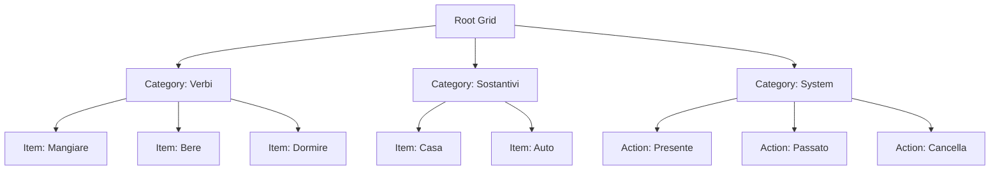

# Grid Management API

The Grid Management API handles communication grid operations including setup, CRUD operations on grid items, and template management. All endpoints require authentication unless otherwise specified.

## Base URL

```
http://localhost:3000/api
```

## Grid Structure

Communication grids consist of hierarchical items organized by categories:



## Grid Templates

### Available Templates

| Template | Description | Items |
|----------|-------------|-------|
| `default` | Complete grid with all predefined categories | ~100 items |
| `simplified` | Essential categories for basic communication | ~50 items |
| `empty` | Empty grid for complete customization | 0 items |

## Endpoints

### POST /api/setup

Initialize user's communication grid with a selected template.

!!! note "Protected Endpoint"
    Requires valid JWT token and user must have `pending_setup` status.

#### Request

```http
POST /api/setup
Authorization: Bearer <jwt-token>
Content-Type: application/json

{
  "gridType": "default"
}
```

#### Request Body

| Field | Type | Required | Description |
|-------|------|----------|-------------|
| `gridType` | string | Yes | Template type: `default`, `simplified`, or `empty` |

#### Response

=== "Success (201 Created)"
    ```json
    {
      "message": "Grid setup completed successfully",
      "gridType": "default",
      "itemsCreated": 98,
      "categories": [
        "verbi",
        "sostantivi", 
        "aggettivi",
        "azioni",
        "system"
      ]
    }
    ```

=== "Already Setup (409 Conflict)"
    ```json
    {
      "error": "User has already completed setup"
    }
    ```

=== "Invalid Template (400 Bad Request)"
    ```json
    {
      "error": "Invalid grid type. Must be: default, simplified, or empty"
    }
    ```

#### Example Usage

```javascript
const setupGrid = async (gridType) => {
  const response = await fetch('/api/setup', {
    method: 'POST',
    headers: {
      'Authorization': `Bearer ${localStorage.getItem('authToken')}`,
      'Content-Type': 'application/json'
    },
    body: JSON.stringify({ gridType })
  });
  
  const result = await response.json();
  
  if (response.ok) {
    console.log(`Grid setup complete: ${result.itemsCreated} items created`);
    // Proceed to complete setup
  } else {
    console.error('Setup failed:', result.error);
  }
};
```

### POST /api/complete-setup

Mark the user's setup as complete and activate their account.

!!! note "Protected Endpoint"
    Requires valid JWT token.

#### Request

```http
POST /api/complete-setup
Authorization: Bearer <jwt-token>
```

#### Response

=== "Success (200 OK)"
    ```json
    {
      "message": "Setup completed successfully",
      "user": {
        "id": 1,
        "username": "john_doe", 
        "status": "active"
      }
    }
    ```

=== "Already Active (409 Conflict)"
    ```json
    {
      "error": "User is already active"
    }
    ```

#### Example Usage

```javascript
const completeSetup = async () => {
  const response = await fetch('/api/complete-setup', {
    method: 'POST',
    headers: {
      'Authorization': `Bearer ${localStorage.getItem('authToken')}`
    }
  });
  
  if (response.ok) {
    // Update user status in localStorage
    const user = JSON.parse(localStorage.getItem('user'));
    user.status = 'active';
    localStorage.setItem('user', JSON.stringify(user));
    
    // Redirect to main grid
    window.location.href = '/';
  }
};
```

### GET /api/grid

Retrieve the user's complete communication grid.

!!! note "Protected Endpoint"
    Requires valid JWT token.

#### Request

```http
GET /api/grid
Authorization: Bearer <jwt-token>
```

#### Response

=== "Success (200 OK)"
    ```json
    {
      "items": [
        {
          "id": 1,
          "user_id": 1,
          "type": "category",
          "label": "Verbi",
          "icon": "fa-play",
          "color": "#4CAF50",
          "category": "verbi",
          "parent_id": null,
          "order_index": 1,
          "visible": true
        },
        {
          "id": 2,
          "user_id": 1,
          "type": "item",
          "label": "Mangiare",
          "icon": "fa-utensils",
          "color": "#FF9800",
          "text": "mangiare",
          "speak": "mangiare",
          "category": "verbi",
          "parent_id": 1,
          "order_index": 1,
          "visible": true
        }
      ],
      "categories": ["verbi", "sostantivi", "azioni", "system"],
      "totalItems": 98,
      "lastUpdated": "2025-01-15T10:30:00Z"
    }
    ```

=== "No Grid Found (404 Not Found)"
    ```json
    {
      "error": "No grid found for user. Please complete setup first.",
      "items": [],
      "categories": []
    }
    ```

#### Response Fields

| Field | Type | Description |
|-------|------|-------------|
| `items` | array | Complete list of grid items |
| `categories` | array | List of available categories |
| `totalItems` | number | Total count of visible items |
| `lastUpdated` | string | ISO timestamp of last modification |

#### Grid Item Structure

| Field | Type | Description |
|-------|------|-------------|
| `id` | number | Unique item identifier |
| `user_id` | number | Owner user ID |
| `type` | string | Item type: `category`, `item`, `action` |
| `label` | string | Display text |
| `icon` | string | Icon identifier (Font Awesome class) |
| `color` | string | Color code (hex format) |
| `text` | string | Extended text content |
| `speak` | string | Text-to-speech content |
| `action` | string | Action type for system items |
| `category` | string | Category classification |
| `parent_id` | number/null | Parent item ID for hierarchy |
| `order_index` | number | Display order within category |
| `visible` | boolean | Visibility flag |

#### Example Usage

```javascript
const loadGrid = async () => {
  const response = await fetch('/api/grid', {
    headers: {
      'Authorization': `Bearer ${localStorage.getItem('authToken')}`
    }
  });
  
  const gridData = await response.json();
  
  if (response.ok) {
    console.log(`Loaded ${gridData.totalItems} grid items`);
    
    // Organize items by category
    const itemsByCategory = {};
    gridData.items.forEach(item => {
      if (!itemsByCategory[item.category]) {
        itemsByCategory[item.category] = [];
      }
      itemsByCategory[item.category].push(item);
    });
    
    return itemsByCategory;
  } else {
    console.error('Failed to load grid:', gridData.error);
  }
};
```

### POST /api/grid

Save the entire grid (bulk update operation).

!!! note "Protected Endpoint"
    Requires valid JWT token.

#### Request

```http
POST /api/grid
Authorization: Bearer <jwt-token>
Content-Type: application/json

{
  "items": [
    {
      "id": 1,
      "type": "category",
      "label": "Verbi Modificati",
      "icon": "fa-play",
      "color": "#4CAF50",
      "category": "verbi",
      "order_index": 1,
      "visible": true
    }
  ]
}
```

#### Request Body

| Field | Type | Required | Description |
|-------|------|----------|-------------|
| `items` | array | Yes | Complete array of grid items |

#### Response

=== "Success (200 OK)"
    ```json
    {
      "message": "Grid saved successfully",
      "itemsUpdated": 15,
      "itemsCreated": 2,
      "itemsDeleted": 1,
      "timestamp": "2025-01-15T10:35:00Z"
    }
    ```

=== "Validation Error (400 Bad Request)"
    ```json
    {
      "error": "Invalid grid data",
      "details": "Item at index 5 is missing required 'type' field"
    }
    ```

### POST /api/grid/item

Create a new grid item.

!!! note "Protected Endpoint"
    Requires valid JWT token.

#### Request

```http
POST /api/grid/item
Authorization: Bearer <jwt-token>
Content-Type: application/json

{
  "type": "item",
  "label": "Camminare",
  "icon": "fa-walking",
  "color": "#9C27B0",
  "text": "camminare",
  "speak": "camminare",
  "category": "verbi",
  "parent_id": 1,
  "order_index": 10,
  "visible": true
}
```

#### Request Body

| Field | Type | Required | Description |
|-------|------|----------|-------------|
| `type` | string | Yes | Item type: `category`, `item`, `action` |
| `label` | string | Yes | Display text |
| `icon` | string | No | Icon identifier |
| `color` | string | No | Color code |
| `text` | string | No | Extended text content |
| `speak` | string | No | Text-to-speech content |
| `action` | string | No | Action type (for system items) |
| `category` | string | Yes | Category classification |
| `parent_id` | number | No | Parent item ID |
| `order_index` | number | No | Display order (default: 0) |
| `visible` | boolean | No | Visibility flag (default: true) |

#### Response

=== "Success (201 Created)"
    ```json
    {
      "message": "Grid item created successfully",
      "item": {
        "id": 99,
        "user_id": 1,
        "type": "item",
        "label": "Camminare",
        "icon": "fa-walking",
        "color": "#9C27B0",
        "text": "camminare",
        "speak": "camminare",
        "category": "verbi",
        "parent_id": 1,
        "order_index": 10,
        "visible": true,
        "created_at": "2025-01-15T10:40:00Z"
      }
    }
    ```

#### Example Usage

```javascript
const createGridItem = async (itemData) => {
  const response = await fetch('/api/grid/item', {
    method: 'POST',
    headers: {
      'Authorization': `Bearer ${localStorage.getItem('authToken')}`,
      'Content-Type': 'application/json'
    },
    body: JSON.stringify(itemData)
  });
  
  const result = await response.json();
  
  if (response.ok) {
    console.log('Item created:', result.item);
    return result.item;
  } else {
    console.error('Failed to create item:', result.error);
    throw new Error(result.error);
  }
};
```

### PUT /api/grid/item/:id

Update an existing grid item.

!!! note "Protected Endpoint"
    Requires valid JWT token. Users can only update their own items.

#### Request

```http
PUT /api/grid/item/99
Authorization: Bearer <jwt-token>
Content-Type: application/json

{
  "label": "Camminare Velocemente",
  "color": "#E91E63",
  "order_index": 5
}
```

#### URL Parameters

| Parameter | Type | Description |
|-----------|------|-------------|
| `id` | number | Grid item ID to update |

#### Request Body

Send only the fields you want to update. All fields from the create endpoint are supported.

#### Response

=== "Success (200 OK)"
    ```json
    {
      "message": "Grid item updated successfully", 
      "item": {
        "id": 99,
        "user_id": 1,
        "type": "item",
        "label": "Camminare Velocemente",
        "icon": "fa-walking",
        "color": "#E91E63",
        "text": "camminare",
        "speak": "camminare",
        "category": "verbi", 
        "parent_id": 1,
        "order_index": 5,
        "visible": true,
        "updated_at": "2025-01-15T10:45:00Z"
      }
    }
    ```

=== "Not Found (404 Not Found)"
    ```json
    {
      "error": "Grid item not found or access denied"
    }
    ```

#### Example Usage

```javascript
const updateGridItem = async (itemId, updates) => {
  const response = await fetch(`/api/grid/item/${itemId}`, {
    method: 'PUT',
    headers: {
      'Authorization': `Bearer ${localStorage.getItem('authToken')}`,
      'Content-Type': 'application/json'
    },
    body: JSON.stringify(updates)
  });
  
  const result = await response.json();
  
  if (response.ok) {
    console.log('Item updated:', result.item);
    return result.item;
  } else {
    console.error('Failed to update item:', result.error);
    throw new Error(result.error);
  }
};
```

### DELETE /api/grid/item/:id

Delete a grid item (soft delete).

!!! note "Protected Endpoint"
    Requires valid JWT token. Users can only delete their own items.

#### Request

```http
DELETE /api/grid/item/99
Authorization: Bearer <jwt-token>
```

#### URL Parameters

| Parameter | Type | Description |
|-----------|------|-------------|
| `id` | number | Grid item ID to delete |

#### Response

=== "Success (200 OK)"
    ```json
    {
      "message": "Grid item deleted successfully",
      "itemId": 99
    }
    ```

=== "Not Found (404 Not Found)"
    ```json
    {
      "error": "Grid item not found or access denied"
    }
    ```

#### Example Usage

```javascript
const deleteGridItem = async (itemId) => {
  const response = await fetch(`/api/grid/item/${itemId}`, {
    method: 'DELETE',
    headers: {
      'Authorization': `Bearer ${localStorage.getItem('authToken')}`
    }
  });
  
  const result = await response.json();
  
  if (response.ok) {
    console.log('Item deleted:', result.itemId);
    return true;
  } else {
    console.error('Failed to delete item:', result.error);
    throw new Error(result.error);
  }
};
```

## Grid Templates Details

### Default Template

The default template includes comprehensive categories:

```javascript
const defaultCategories = [
  {
    name: "verbi",
    label: "Verbi",
    icon: "fa-play",
    color: "#4CAF50",
    items: ["essere", "avere", "andare", "fare", "dire", "mangiare", "bere", ...]
  },
  {
    name: "sostantivi", 
    label: "Sostantivi",
    icon: "fa-cube",
    color: "#FF9800",
    items: ["casa", "auto", "libro", "acqua", "cibo", ...]
  },
  {
    name: "aggettivi",
    label: "Aggettivi", 
    icon: "fa-star",
    color: "#E91E63",
    items: ["bello", "grande", "piccolo", "buono", "cattivo", ...]
  },
  {
    name: "azioni",
    label: "Azioni",
    icon: "fa-bolt", 
    color: "#9C27B0",
    items: ["aprire", "chiudere", "accendere", "spegnere", ...]
  },
  {
    name: "system",
    label: "Sistema",
    icon: "fa-cog",
    color: "#607D8B", 
    actions: ["presente", "passato", "futuro", "cancella", "indietro"]
  }
];
```

### Simplified Template

Focused on essential communication:

```javascript
const simplifiedCategories = [
  {
    name: "base",
    label: "Base", 
    items: ["io", "tu", "lui", "lei", "noi", "voi", "loro"]
  },
  {
    name: "verbi_comuni",
    label: "Verbi Comuni",
    items: ["essere", "avere", "andare", "volere", "mangiare"]
  },
  {
    name: "sostantivi_comuni", 
    label: "Sostantivi Comuni",
    items: ["casa", "acqua", "cibo", "famiglia", "tempo"]
  },
  {
    name: "system",
    label: "Sistema",
    actions: ["presente", "cancella"]
  }
];
```

## Frontend Integration

### Complete Grid Management Class

```javascript
class GridManager {
  constructor() {
    this.authToken = localStorage.getItem('authToken');
    this.baseURL = '/api';
  }
  
  getHeaders() {
    return {
      'Authorization': `Bearer ${this.authToken}`,
      'Content-Type': 'application/json'
    };
  }
  
  async setupGrid(gridType) {
    const response = await fetch(`${this.baseURL}/setup`, {
      method: 'POST',
      headers: this.getHeaders(),
      body: JSON.stringify({ gridType })
    });
    
    if (!response.ok) {
      const error = await response.json();
      throw new Error(error.error);
    }
    
    return response.json();
  }
  
  async completeSetup() {
    const response = await fetch(`${this.baseURL}/complete-setup`, {
      method: 'POST',
      headers: this.getHeaders()
    });
    
    return response.json();
  }
  
  async loadGrid() {
    const response = await fetch(`${this.baseURL}/grid`, {
      headers: this.getHeaders()
    });
    
    return response.json();
  }
  
  async saveGrid(items) {
    const response = await fetch(`${this.baseURL}/grid`, {
      method: 'POST', 
      headers: this.getHeaders(),
      body: JSON.stringify({ items })
    });
    
    return response.json();
  }
  
  async createItem(itemData) {
    const response = await fetch(`${this.baseURL}/grid/item`, {
      method: 'POST',
      headers: this.getHeaders(),
      body: JSON.stringify(itemData)
    });
    
    return response.json();
  }
  
  async updateItem(itemId, updates) {
    const response = await fetch(`${this.baseURL}/grid/item/${itemId}`, {
      method: 'PUT',
      headers: this.getHeaders(), 
      body: JSON.stringify(updates)
    });
    
    return response.json();
  }
  
  async deleteItem(itemId) {
    const response = await fetch(`${this.baseURL}/grid/item/${itemId}`, {
      method: 'DELETE',
      headers: this.getHeaders()
    });
    
    return response.json();
  }
}
```

---

**Next:** [AI Services API →](ai.md)
