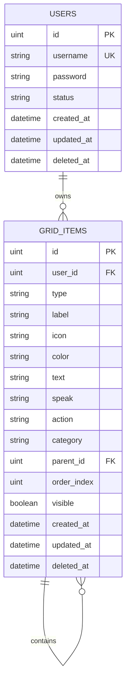

# Database Schema

Web App CAA uses a simple yet flexible database schema designed to support user management and customizable communication grids. The schema supports both SQLite (for development) and MySQL (for production).

## Database Overview

The application uses two main entities:
- **Users**: Authentication and user management
- **Grid Items**: Communication grid elements with hierarchical organization

## Entity Relationship Diagram



## Table Definitions

### Users Table

The `users` table manages user authentication and account information.

```sql
CREATE TABLE users (
    id            INTEGER      PRIMARY KEY AUTOINCREMENT,  -- SQLite
    -- id         BIGINT       PRIMARY KEY AUTO_INCREMENT,  -- MySQL
    username      VARCHAR(255) UNIQUE NOT NULL,
    password      VARCHAR(255) NOT NULL,
    status        VARCHAR(50)  DEFAULT 'pending_setup',
    created_at    DATETIME,
    updated_at    DATETIME,
    deleted_at    DATETIME     -- Soft delete support
);

-- Indexes
CREATE UNIQUE INDEX idx_users_username ON users(username);
CREATE INDEX idx_users_deleted_at ON users(deleted_at);
```

#### User Fields

| Field | Type | Constraints | Description |
|-------|------|-------------|-------------|
| `id` | uint | Primary Key, Auto Increment | Unique user identifier |
| `username` | string | Unique, Not Null | User's login name |
| `password` | string | Not Null | bcrypt hashed password |
| `status` | string | Default: 'pending_setup' | User account status |
| `created_at` | datetime | Auto-managed | Account creation timestamp |
| `updated_at` | datetime | Auto-managed | Last modification timestamp |
| `deleted_at` | datetime | Nullable | Soft delete timestamp |

#### User Status Values

| Status | Description |
|--------|-------------|
| `pending_setup` | User registered but hasn't completed initial setup |
| `active` | User has completed setup and can use the application |
| `disabled` | User account is temporarily disabled |

### Grid Items Table

The `grid_items` table stores all communication grid elements for all users.

```sql
CREATE TABLE grid_items (
    id            INTEGER      PRIMARY KEY AUTOINCREMENT,  -- SQLite
    -- id         BIGINT       PRIMARY KEY AUTO_INCREMENT,  -- MySQL
    user_id       INTEGER      NOT NULL,
    type          VARCHAR(50)  NOT NULL,
    label         VARCHAR(255),
    icon          VARCHAR(255),
    color         VARCHAR(50),
    text          TEXT,
    speak         VARCHAR(255),
    action        VARCHAR(100),
    category      VARCHAR(100),
    parent_id     INTEGER,
    order_index   INTEGER      DEFAULT 0,
    visible       BOOLEAN      DEFAULT true,
    created_at    DATETIME,
    updated_at    DATETIME,
    deleted_at    DATETIME,
    
    -- Foreign key constraints
    FOREIGN KEY (user_id) REFERENCES users(id) ON DELETE CASCADE,
    FOREIGN KEY (parent_id) REFERENCES grid_items(id) ON DELETE SET NULL
);

-- Indexes
CREATE INDEX idx_grid_items_user_id ON grid_items(user_id);
CREATE INDEX idx_grid_items_parent_id ON grid_items(parent_id);
CREATE INDEX idx_grid_items_category ON grid_items(category);
CREATE INDEX idx_grid_items_type ON grid_items(type);
CREATE INDEX idx_grid_items_deleted_at ON grid_items(deleted_at);
CREATE INDEX idx_grid_items_user_category ON grid_items(user_id, category);
```

#### Grid Item Fields

| Field | Type | Constraints | Description |
|-------|------|-------------|-------------|
| `id` | uint | Primary Key, Auto Increment | Unique item identifier |
| `user_id` | uint | Foreign Key, Not Null | Owner of this grid item |
| `type` | string | Not Null | Item type (category, item, action) |
| `label` | string | | Display text for the item |
| `icon` | string | | Icon identifier or path |
| `color` | string | | Color code (hex, rgb, or name) |
| `text` | string | | Extended text content |
| `speak` | string | | Text-to-speech content |
| `action` | string | | Action type when item is selected |
| `category` | string | | Category classification |
| `parent_id` | uint | Foreign Key, Nullable | Parent item for hierarchy |
| `order_index` | uint | Default: 0 | Display order within category |
| `visible` | bool | Default: true | Whether item is visible |

#### Item Types

| Type | Description | Usage |
|------|-------------|-------|
| `category` | Top-level category | Groups related items |
| `item` | Communication item | Basic grid element |
| `action` | System action | Special functionality |
| `separator` | Visual separator | UI organization |

#### Action Types

| Action | Description |
|--------|-------------|
| `speak` | Text-to-speech |
| `clear` | Clear current sentence |
| `backspace` | Remove last word |
| `conjugate_presente` | Conjugate to present tense |
| `conjugate_passato` | Conjugate to past tense |
| `conjugate_futuro` | Conjugate to future tense |
| `correct_sentence` | AI sentence correction |

## GORM Model Definitions

### User Model

```go
type User struct {
    ID        uint      `gorm:"primaryKey" json:"id"`
    Username  string    `gorm:"unique;not null" json:"username"`
    Password  string    `gorm:"not null" json:"-"` // Never serialize password
    Status    string    `gorm:"default:pending_setup" json:"status"`
    CreatedAt time.Time `json:"created_at"`
    UpdatedAt time.Time `json:"updated_at"`
    DeletedAt gorm.DeletedAt `gorm:"index" json:"-"`
    
    // Relationships
    GridItems []GridItem `gorm:"foreignKey:UserID;constraint:OnDelete:CASCADE" json:"grid_items,omitempty"`
}

// Table name override (optional)
func (User) TableName() string {
    return "users"
}
```

### Grid Item Model

```go
type GridItem struct {
    ID         uint   `gorm:"primaryKey" json:"id"`
    UserID     uint   `gorm:"not null;index" json:"user_id"`
    Type       string `gorm:"not null;index" json:"type"`
    Label      string `json:"label"`
    Icon       string `json:"icon"`
    Color      string `json:"color"`
    Text       string `json:"text"`
    Speak      string `json:"speak"`
    Action     string `json:"action"`
    Category   string `gorm:"index" json:"category"`
    ParentID   *uint  `gorm:"index" json:"parent_id"` // Nullable for root items
    OrderIndex uint   `gorm:"default:0" json:"order_index"`
    Visible    bool   `gorm:"default:true" json:"visible"`
    CreatedAt  time.Time `json:"created_at"`
    UpdatedAt  time.Time `json:"updated_at"`
    DeletedAt  gorm.DeletedAt `gorm:"index" json:"-"`
    
    // Relationships
    User     User        `gorm:"constraint:OnDelete:CASCADE" json:"user,omitempty"`
    Parent   *GridItem   `gorm:"foreignKey:ParentID" json:"parent,omitempty"`
    Children []GridItem  `gorm:"foreignKey:ParentID" json:"children,omitempty"`
}

// Table name override
func (GridItem) TableName() string {
    return "grid_items"
}
```

## Database Operations

### Common Queries

#### User Operations

```go
// Create user
func CreateUser(db *gorm.DB, user *User) error {
    return db.Create(user).Error
}

// Find user by username
func FindUserByUsername(db *gorm.DB, username string) (*User, error) {
    var user User
    err := db.Where("username = ?", username).First(&user).Error
    return &user, err
}

// Update user status
func UpdateUserStatus(db *gorm.DB, userID uint, status string) error {
    return db.Model(&User{}).Where("id = ?", userID).
        Update("status", status).Error
}
```

#### Grid Operations

```go
// Get user's grid items
func GetUserGridItems(db *gorm.DB, userID uint) ([]GridItem, error) {
    var items []GridItem
    err := db.Where("user_id = ? AND visible = ?", userID, true).
        Order("category, order_index").
        Find(&items).Error
    return items, err
}

// Create grid item
func CreateGridItem(db *gorm.DB, item *GridItem) error {
    return db.Create(item).Error
}

// Update grid item
func UpdateGridItem(db *gorm.DB, item *GridItem) error {
    return db.Save(item).Error
}

// Delete grid item (soft delete)
func DeleteGridItem(db *gorm.DB, itemID, userID uint) error {
    return db.Where("id = ? AND user_id = ?", itemID, userID).
        Delete(&GridItem{}).Error
}
```

#### Bulk Operations

```go
// Bulk create grid items (for setup)
func BulkCreateGridItems(db *gorm.DB, items []GridItem) error {
    return db.Transaction(func(tx *gorm.DB) error {
        return tx.CreateInBatches(items, 100).Error
    })
}

// Get items by category
func GetItemsByCategory(db *gorm.DB, userID uint, category string) ([]GridItem, error) {
    var items []GridItem
    err := db.Where("user_id = ? AND category = ? AND visible = ?", 
        userID, category, true).
        Order("order_index").
        Find(&items).Error
    return items, err
}
```

## Database Migrations

GORM handles automatic migrations when the application starts:

```go
func Initialize() {
    // Connect to database
    db, err := gorm.Open(sqlite.Open("database.sqlite"), &gorm.Config{})
    if err != nil {
        log.Fatal("Failed to connect to database:", err)
    }
    
    // Auto-migrate schemas
    db.AutoMigrate(&User{}, &GridItem{})
    
    // Set up foreign key constraints (SQLite specific)
    db.Exec("PRAGMA foreign_keys = ON")
}
```

## Sample Data Structure

### User Record

```json
{
    "id": 1,
    "username": "john_doe",
    "password": "$2a$10$...", // bcrypt hash
    "status": "active",
    "created_at": "2025-01-01T10:00:00Z",
    "updated_at": "2025-01-01T10:30:00Z"
}
```

### Grid Item Records

#### Category Item
```json
{
    "id": 1,
    "user_id": 1,
    "type": "category",
    "label": "Azioni",
    "icon": "fa-play",
    "color": "#4CAF50",
    "category": "actions",
    "parent_id": null,
    "order_index": 1,
    "visible": true
}
```

#### Communication Item
```json
{
    "id": 2,
    "user_id": 1,
    "type": "item",
    "label": "Mangiare",
    "icon": "fa-utensils",
    "color": "#FF9800",
    "text": "mangiare",
    "speak": "mangiare",
    "category": "verbi",
    "parent_id": 1,
    "order_index": 1,
    "visible": true
}
```

#### Action Item
```json
{
    "id": 3,
    "user_id": 1,
    "type": "action",
    "label": "Presente",
    "icon": "fa-clock",
    "color": "#2196F3",
    "action": "conjugate_presente",
    "category": "system",
    "order_index": 1,
    "visible": true
}
```

## Performance Considerations

### Indexing Strategy

1. **Primary Keys**: Automatic indexing on `id` fields
2. **Foreign Keys**: Indexes on `user_id` and `parent_id`
3. **Query Optimization**: Indexes on frequently queried fields
4. **Composite Indexes**: `(user_id, category)` for grid queries

### Connection Pooling

```go
// MySQL connection pool settings
db, err := gorm.Open(mysql.Open(dsn), &gorm.Config{})
if err != nil {
    log.Fatal(err)
}

sqlDB, _ := db.DB()
sqlDB.SetMaxOpenConns(25)
sqlDB.SetMaxIdleConns(5)
sqlDB.SetConnMaxLifetime(5 * time.Minute)
```

### Query Optimization

1. **Eager Loading**: Use `Preload()` for related data
2. **Selective Fields**: Use `Select()` to limit returned columns
3. **Batch Operations**: Use `CreateInBatches()` for bulk inserts
4. **Soft Deletes**: Automatic handling with GORM

## Backup and Recovery

### SQLite Backup

```bash
# Create backup
sqlite3 database.sqlite ".backup backup.sqlite"

# Restore from backup
cp backup.sqlite database.sqlite
```

### MySQL Backup

```bash
# Create backup
mysqldump -u username -p webapp_caa > backup.sql

# Restore from backup
mysql -u username -p webapp_caa < backup.sql
```

---

**Next:** [API Reference →](../api/authentication.md)
