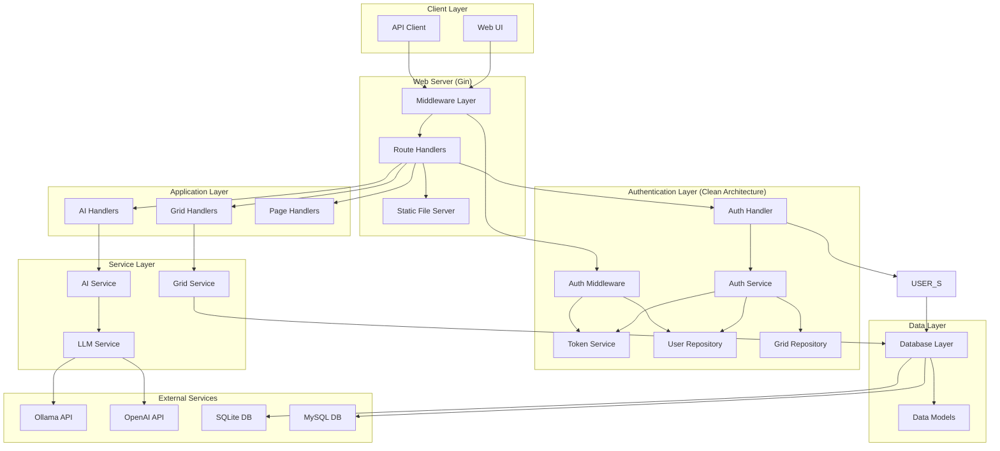
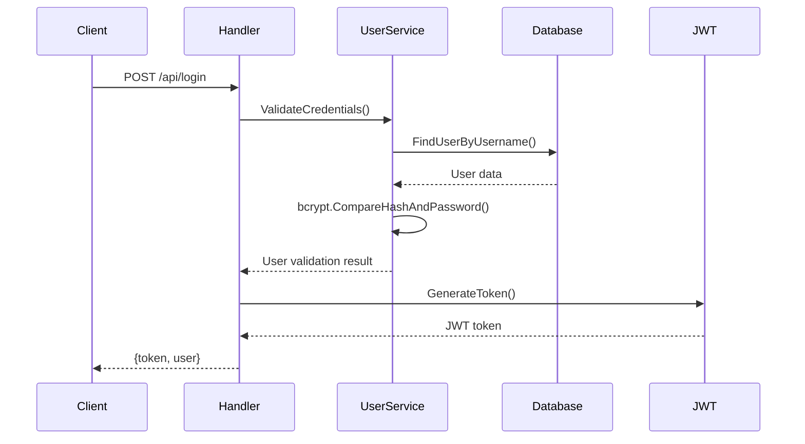
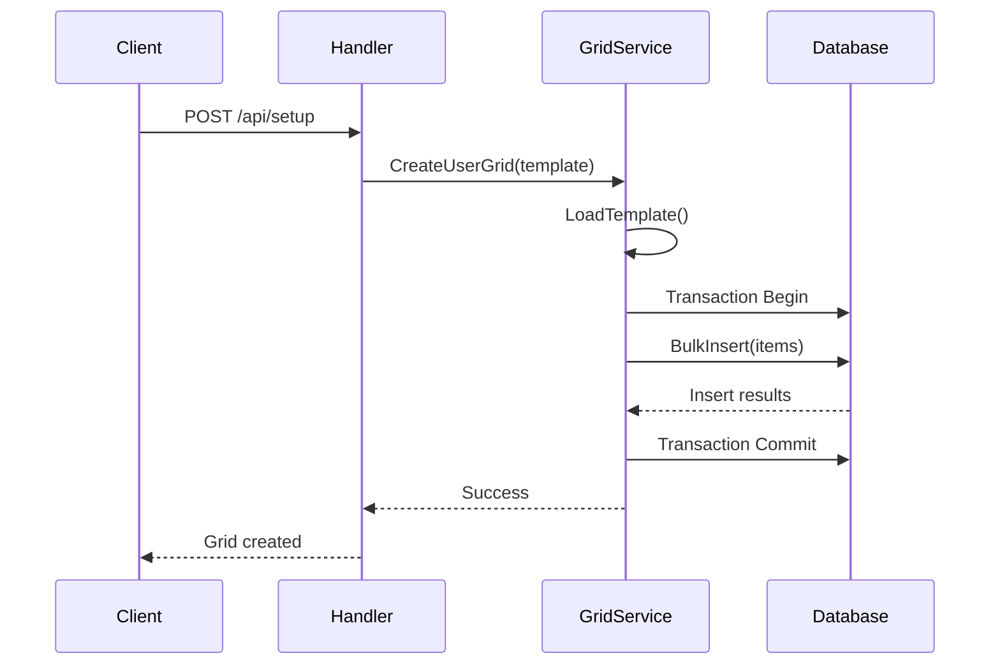
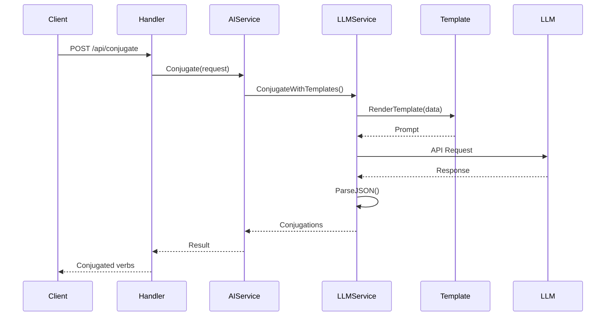
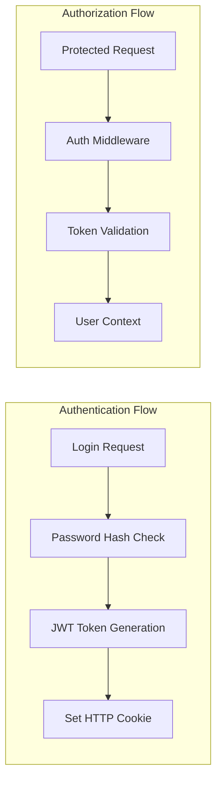

# Architecture Overview

Web App CAA follows a clean, layered architecture with SOLID principles that promotes maintainability, testability, and scalability. The authentication system implements clean architecture patterns with proper separation of concerns.

## System Architecture



## Architectural Principles

### 1. **Clean Architecture**

The application follows clean architecture principles:

- **Dependency Inversion**: High-level modules don't depend on low-level modules
- **Separation of Concerns**: Each layer has a single, well-defined responsibility  
- **Independence**: Business logic is independent of frameworks and external services

### 2. **Layered Design**

| Layer | Responsibility | Examples |
|-------|----------------|----------|
| **Presentation** | HTTP handling, routing | Gin handlers, middleware |
| **Application** | Request/response processing | Handler functions |
| **Domain** | Business logic | Services, validation |
| **Infrastructure** | External dependencies | Database, AI APIs |

### 3. **Modular Structure**

Each module is self-contained with clear interfaces:

- **Authentication**: User registration, login, JWT management
- **Grid Management**: CRUD operations, templates, categories
- **AI Services**: LLM integration, prompt processing
- **Database**: ORM abstraction, migrations

## Component Details

### Web Server Layer

#### Gin Web Framework

```go
// Main server setup
r := gin.Default()
r.Use(middleware.RequestLogging())
r.Use(corsMiddleware())
```

**Key Features:**
- HTTP/HTTPS server
- Request routing
- Middleware pipeline
- Static file serving
- Template rendering

#### Middleware Stack

1. **Request Logging**: Logs all HTTP requests with timing
2. **CORS**: Cross-Origin Resource Sharing configuration
3. **Authentication**: JWT token validation for protected routes
4. **Error Handling**: Centralized error processing

### Handler Layer

#### Authentication System (Clean Architecture)

The authentication system follows clean architecture principles with clear separation of concerns:

```go
// Handler - HTTP layer
type Handler struct {
    authService AuthService
}

// Service - Business logic layer
type AuthServiceImpl struct {
    userRepo     UserRepository
    gridRepo     GridRepository
    tokenService TokenService
    config       *Config
}

// Repository - Data layer
type GormUserRepository struct {
    db *gorm.DB
}

// Token Service - JWT operations
type JWTTokenService struct {
    config *Config
}

// Middleware - Request authentication
type Middleware struct {
    tokenService TokenService
    userRepo     UserRepository
}
```

**Architecture Features:**
- **SOLID Principles**: Every component follows Single Responsibility, Open/Closed, Liskov Substitution, Interface Segregation, and Dependency Inversion
- **Dependency Injection**: All dependencies injected via interfaces using factory pattern
- **Interface-Based Design**: All components depend on abstractions, not concretions
- **Comprehensive Error Handling**: Proper error types and HTTP status codes
- **Security**: Uses `golang-jwt/jwt/v5` with secure token implementation

**Responsibilities:**
- **Handler**: HTTP request/response handling
- **AuthService**: Business logic (registration, login, validation)
- **TokenService**: JWT token generation, validation, and extraction
- **UserRepository**: Data persistence operations
- **Middleware**: Request authentication and authorization
- **Factory**: Dependency injection and component wiring

#### Grid Handlers

```go
type GridHandlers struct {
    gridService *services.GridService
}
```

**Responsibilities:**
- Grid template selection
- CRUD operations on grid items
- Category management
- Setup wizard logic

#### AI Handlers

```go
type AIHandlers struct {
    aiService *services.AIService
}
```

**Responsibilities:**
- Verb conjugation requests
- Sentence correction
- AI service proxy functionality

### Service Layer

#### User Service

```go
type UserService struct {
    db *gorm.DB
}
```

**Features:**
- Password hashing with bcrypt
- User profile management
- Status tracking (pending_setup/active)
- Database transaction handling

#### Grid Service

```go
type GridService struct {
    db *gorm.DB
}
```

**Features:**
- Grid template loading
- Item CRUD operations
- Category hierarchy management
- Bulk operations for setup

#### AI Service

```go
type AIService struct {
    llmService *LLMService
}
```

**Features:**
- Request routing to appropriate LLM backend
- Response processing and formatting
- Error handling and fallback logic

#### LLM Service

```go
type LLMService struct {
    backendType    string
    ollamaClient   ollama.Client
    openaiClient   *openai.Client
    templates      map[string]*template.Template
    ragData        map[string]interface{}
}
```

**Features:**
- Multi-backend LLM support (Ollama, OpenAI)
- Template-based prompt generation
- RAG (Retrieval-Augmented Generation) knowledge integration
- Response parsing and validation

### Data Layer

#### GORM ORM

```go
type Database struct {
    DB *gorm.DB
}
```

**Features:**
- Automatic schema migration
- Connection pooling
- Transaction support
- Multi-database support (SQLite, MySQL)

#### Data Models

```go
type User struct {
    ID       uint   `gorm:"primaryKey"`
    Username string `gorm:"unique;not null"`
    Password string `gorm:"not null"`
    Status   string `gorm:"default:pending_setup"`
    // ...
}

type GridItem struct {
    ID     uint   `gorm:"primaryKey"`
    UserID uint   `gorm:"not null"`
    Type   string `gorm:"not null"`
    // ...
}
```

## Data Flow

### Authentication Flow



### Grid Management Flow



### AI Service Flow



## Technology Stack

### Core Technologies

| Component | Technology | Version | Purpose |
|-----------|------------|---------|---------|
| **Language** | Go | 1.21+ | Main programming language |
| **Web Framework** | Gin | 1.10+ | HTTP server and routing |
| **ORM** | GORM | 1.30+ | Database abstraction |
| **Authentication** | JWT-Go | 5.3+ | Token-based auth |
| **Password Hashing** | bcrypt | - | Secure password storage |

### Database Support

| Database | Use Case | Driver |
|----------|----------|--------|
| **SQLite** | Development, small deployments | `gorm.io/driver/sqlite` |
| **MySQL** | Production, high traffic | `gorm.io/driver/mysql` |

### AI Integration

| Service | Client | Use Case |
|---------|---------|----------|
| **Ollama** | Custom client | Local LLM inference |
| **OpenAI** | Official SDK | Cloud-based AI |
| **Templates** | Go templates | Prompt engineering |

## Security Architecture

### Authentication & Authorization



#### Security Measures

1. **Password Security**:
   - bcrypt hashing with salt
   - Configurable cost factor
   - Password strength validation

2. **Token Security**:
   - JWT with HS256 signing
   - Configurable secret key
   - Token expiration

3. **Transport Security**:
   - HTTPS in production
   - CORS configuration
   - Secure cookie flags

### Data Protection

1. **Database Security**:
   - Connection encryption (MySQL SSL)
   - File permissions (SQLite)
   - Prepared statements (SQL injection protection)

2. **Input Validation**:
   - Request payload validation
   - SQL injection prevention
   - XSS protection through templating

## Scalability Considerations

### Horizontal Scaling

The application is designed for horizontal scaling:

- **Stateless Design**: No server-side sessions
- **Database Connection Pooling**: Configurable pool sizes
- **External AI Services**: Offloaded computation

### Performance Optimizations

1. **Database Layer**:
   - Connection pooling
   - Prepared statements
   - Efficient queries with proper indexing

2. **Application Layer**:
   - Middleware caching
   - Static file serving with proper headers
   - Gin's high-performance routing

3. **AI Services**:
   - Template caching
   - Response caching potential
   - Async request processing

## Monitoring and Observability

### Logging

```go
// Structured logging throughout the application
log.Printf("[AUTH] User %s logged in successfully", username)
log.Printf("[GRID] Created %d items for user %d", itemCount, userID)
log.Printf("[AI] Conjugation request processed in %v", duration)
```

### Health Checks

```go
// Health check endpoint
GET /ping
{
  "status": "healthy",
  "database": "connected",
  "ai_service": "available"
}
```

### Metrics Collection

Ready for integration with:
- Prometheus metrics
- Request timing
- Error rate monitoring
- Database connection metrics

---

**Next:** [Project Structure →](structure.md)
